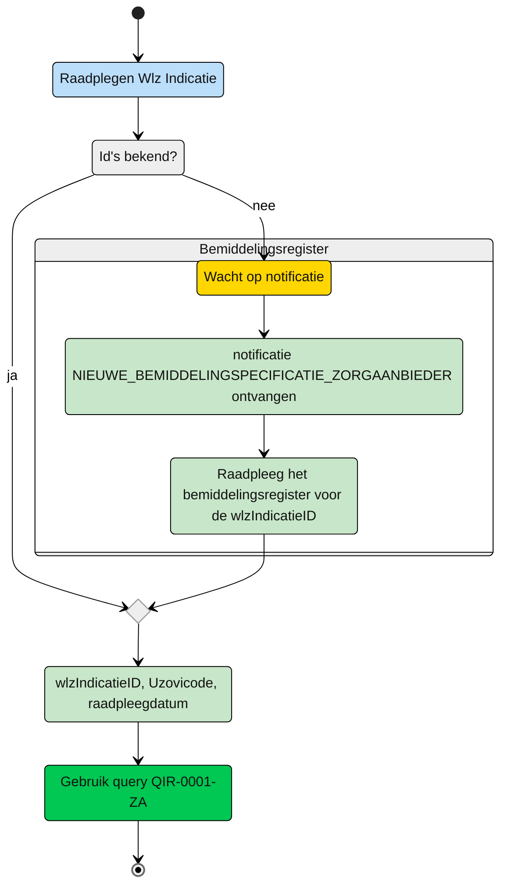
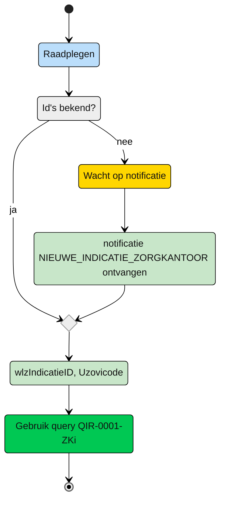

# GraphQL-query templates Indicatieregister
Hier staan de query templates die een raadpleger kan gebruiken voor het raadplegen van gegevens in het Indicatieregister. De templates dienen als voorbeeld hoe de query opgebouwd moet worden. De structuur en bepaalde verplichte parameters zijn nodig om te voldoen aan de autorisatie-policies. Doet een raadpleger dat niet dan kan de vraag niet afgehandeld worden. Bijvoorbeeld doordat de raadpleger benodigde input vergeet mee te geven, gegevens wil raadplegen die niet horen tot de raadpleger of omdat er meer gegevens worden geraadpleegd dan is toegestaan op dat moment. 

Een vraag wordt gesteld door een actor als deelnemer van het netwerk. Deze deelnemer stelt de vraag vanuit een bepaalde autorisatie. Afhankelijk van de autorisatie zijn gegevens wel of niet (direct) raadpleegbaar. 


# Beschikbare templates per rol

Op dit moment zijn de volgende rollen onderkent:
| Deelnemer | rol | toelichting |
| :-- | :-- |:-- |
| Zorgaanbieder | [uitvoerend](#zorgaanbieder---uitvoerend) | Een zorgaanbieder die betrokken is bij de uitvoering van zorg |
| Zorgkantoor | [intieel verantwoordelijke](#zorgkantoor---initieel-verantwoordelijk) | Een zorgkantoor dat initieel verantwoordelijk is voor de client en zorgt voor de bemiddeling van zorg | 
| Zorgkantoor | [nieuw verantwoordelijk](#zorgkantoor---nieuw-verantwoordelijk) | Het zorgkantoor dat de client krijgt overgedragen van het huidige verantwoordelijk zorgkantoor |
| Zorgkantoor | [uitvoerend](#zorgkantoor---uitvoerend) | Een zorgkantoor dat bovenregionaal betrokken is bij de uitvoering van zorg | 

## Zorgaanbieder - uitvoerend

Een zorgaanbieder wordt bij de zorg van een client betrokken door het zorgkantoor. Het zorgkantoor registreert een bemiddelingspecificatie voor de zorgaanbieder. De zorgaanbieder ontvangt hiervan een notificatie ```NIEUWE_BEMIDDELINGSPECIFICATIE_ZORGAANBIEDER```. Op basis van deze notificatie kan de zorgaanbieder de ```wlzIndicatieID``` raadplegen. Met deze ```wlzIndicatieID```, de eigen ```AGBcode``` en de datum van opvragen (```raadpleegdatum```) kan de zorgaanbieder de WlzIndactie gegevens raadplegen. 

**schematisch:**




| **Query ID** | **Beschrijving** | **Verplichte input** | **resultaat** | **Autorisatie** |
|---|---|---|---|---|
| QIR-0001-ZA | | | |


## Zorgkantoor - intieel verantwoordelijk

Het zorgkantoor dat verantwoordelijk is voor de regio waarin de client volgens de BRP woont ontvangt de notificiatie Deze notificatie bevat de informatie om de Wlz Indicatie van de client te raadplegen. Naast de ```wlzIndicatieID``` uit de notificatie moeten het eigen ```Uzovicode``` en de datum van oprvagen (```raadpleegdatum```) worden meegegeven.

**Schematisch:**



| **Query ID** | **Beschrijving** | **Verplichte input** | **resultaat** | **Autorisatie** |
|---|---|---|---|---|
| [**QIR-0001-ZKi**](/gql-query/zorgkantoor/QIR-0001-ZKi.graphql) | Op basis van de (ontvangen) wlzIndicatieID en eigen identificatie, de bijbehorende WlzIndicatie raadplegen inclusief Clientgegevens | wlzIndicatieID,  Uzovicode, raadpleegdatum | Alle klassen/nodes | IRA0001 |

## Zorgkantoor - nieuw verantwoodelijk

Query is nog niet beschikbaar doordat het Bemiddelingsregister nog niet volledig in gebruik is. (Overdracht verloopt tot die tijd via ZK31)


## Zorgkantoor - uitvoerend

Query is nog niet beschikbaar doordat het Bemiddelingsregister nog niet volledig in gebruik is. (Uitvoerend zorgkantoor is altijd de bronhouder zelf en anders via ZK33 indicatiegegevens)


