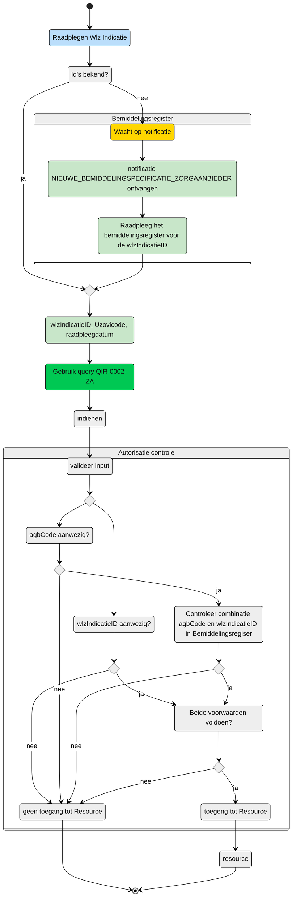

# Autorisatie-flows Zorgaanbieder: QIR-0002-ZA.graphql

**schematisch:**

```mermaid
---
config:
  theme: neutral
  look: classic
---
stateDiagram
    [*] --> raadplegen
    state idAvailable <<choice>>
    
    raadplegen --> idAvailable
    idAvailable --> notifyWait: nee
    state register {
      notifyWait --> notifyReceive
      notifyReceive --> haalData
    }
    state chooseQuery <<choice>>
    idAvailable --> chooseQuery: ja
    haalData --> chooseQuery
    chooseQuery --> inputQuery
    inputQuery --> Query
    Query --> indienen
    indienen --> valideren
    state nID {
      state check <<choice>>
      state check01 <<choice>>
      state check02 <<choice>>
      valideren --> check
      check --> checkInput01
      check --> checkInput02
      checkInput01 --> check01
      checkInput02 --> check02
      check01 --> error: nee
      check01 --> valid: ja
      check02 --> error: nee
      check02 --> valideer2: ja
      
      state check11 <<choice>>
      valideer2 --> check11
      check11 --> error: nee
      check11 --> valid: ja
      state check21 <<choice>>
      valid --> check21
      check21 --> error: nee
      check21 --> access: ja
      
    }
error --> [*]
    access --> resource
    resource --> [*]

  

    raadplegen: Raadplegen Wlz Indicatie
    register: Bemiddelingsregister
    idAvailable: Id's bekend?
    notifyWait: Wacht op notificatie
    notifyReceive: notificatie NIEUWE_BEMIDDELINGSPECIFICATIE_ZORGAANBIEDER ontvangen
    haalData: Raadpleeg het bemiddelingsregister voor de wlzIndicatieID
    inputQuery: wlzIndicatieID, Uzovicode, raadpleegdatum 
    Query: Gebruik query QIR-0002-ZA
    nID: Autorisatie controle
    valideren: valideer input
    checkInput01: wlzIndicatieID aanwezig?
    checkInput02: agbCode aanwezig?
    valideer2: Controleer combinatie agbCode en wlzIndicatieID in Bemiddelingsregiser
    error: geen toegang tot Resource
    valid: Beide voorwaarden voldoen?
    access: toegeng tot Resource


  style notifyWait fill:#FFD600
  style raadplegen fill:#BBDEFB,color:none
  style notifyReceive,haalData,inputQuery fill:#C8E6C9
  style Query fill:#00C853
```

