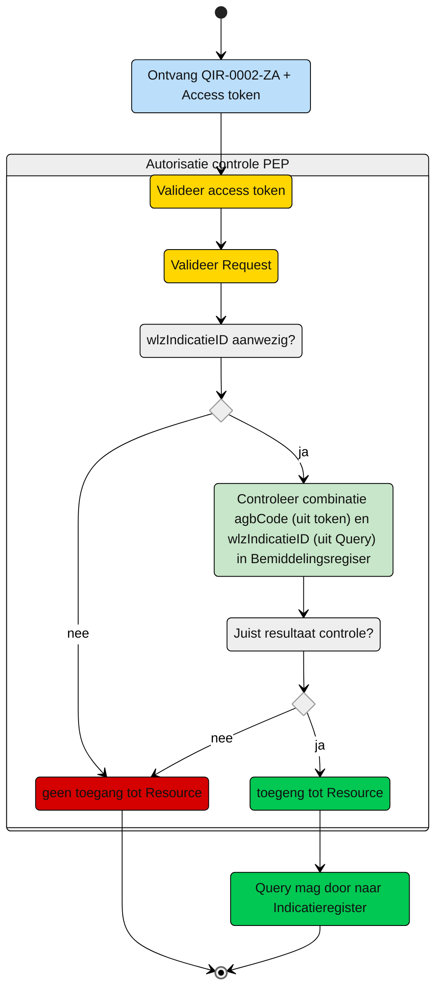

# Autorisatie-flows Zorgaanbieder: QIR-0002-ZA.graphql

Beschrijving van het autorisatieproces door de PEP.

**schematisch:**



**Controle query PIP:**
```gql
query Bemiddeling(
  $WlzIndicatieID: UUID! # uit query
  $agbCodeInstelling: String! # uit Accestoken
) {
  bemiddeling(
    where: {
      wlzIndicatieID: { eq: $WlzIndicatieID }
      and: [ {
         bemiddelingspecificatie:  {
            all:  {
               instelling:  {
                  eq: $agbCodeInstelling
               }
            }
         }
      }]
    }
  ) {
      wlzIndicatieID
      bemiddelingspecificatie {
        instelling
      }
    }
  }

```
Als het resultaat overeenkomt met de variabelen meegegeven in de Indicatiequery of als de combi bestaat dan is toegang toegestaan. 

---
[Terug naar Query overzicht](/gql-query/README.md)