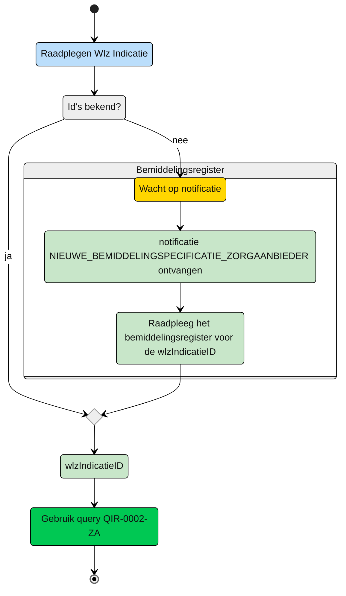

# Query-templates voor de Zorgaanbieder

**Beschikbare Query-templates**
| Deelnemer | rol | toelichting |
| :-- | :-- |:-- |
| Zorgaanbieder | [uitvoerend](#zorgaanbieder---uitvoerend) | Een zorgaanbieder die betrokken is bij de uitvoering van zorg |


## Zorgaanbieder - uitvoerend

Een zorgaanbieder wordt bij de zorg van een client betrokken door het zorgkantoor. Het zorgkantoor registreert een bemiddelingspecificatie voor de zorgaanbieder. De zorgaanbieder ontvangt hiervan een notificatie ```NIEUWE_BEMIDDELINGSPECIFICATIE_ZORGAANBIEDER```. Op basis van deze notificatie kan de zorgaanbieder de ```wlzIndicatieID``` raadplegen in het Bemiddelingregister (zie hiervoor de queries voor het raadplegen van het [Bemiddelingsregister](https://github.com/iStandaarden/iWlz-bemiddeling)). Met deze ```wlzIndicatieID``` kan de zorgaanbieder de WlzIndactie gegevens raadplegen. 

**schematisch:**




| **Query ID** | **Beschrijving** | **Verplichte input** | **resultaat** | **Autorisatie-regel** |
|---|---|---|---|---|
| [QIR-0002-ZA](/gql-query/zorgaanbieder/QIR-0002-ZA.graphql) |  Op basis van de (opgehaalde) wlzIndicatieID en eigen identificatie, de bijbehorende WlzIndicatie raadplegen inclusief Clientgegevens | wlzIndicatieID,  AgbCode | Alle klassen/nodes | [IRA0003](https://informatiemodel.istandaarden.nl/informatiemodel/iwlz/netwerk/indicatieregister-2/regels/autorisatieregel/ira0003/) |

### autorisatieflow en query
Autorisatieflow en query: [QIR-0002-ZA-Autoridatieflow](/gql-query/zorgaanbieder/QIR-0002-ZA-autorisatieflow.md)

---
[Terug naar Query overzicht](/gql-query/README.md)