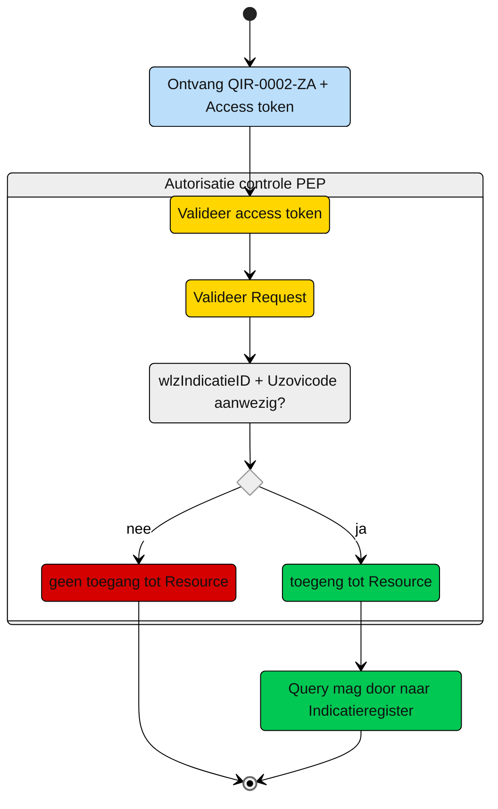

# Autorisatie-flow Zorgkantoor: QIR-0001-ZKi.graphql

Beschrijving van het autorisatieproces door de PEP.

**schematisch:**



Controle query PIP:
```gql
niet van toepassing

```


---
[Terug naar Query overzicht](/gql-query/README.md)