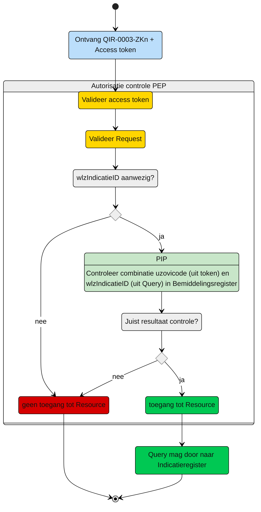

# Autorisatie-flows Zorgaanbieder: QIR-0003-ZKn.graphql

Beschrijving van het autorisatieproces door de PEP.

**schematisch:**



**Controle query PIP:**
```gql
query Bemiddeling(
  $WlzIndicatieID: UUID! # uit query
  $uzovicodeNieuwzorgkantoor: String! # uit Accestoken
) {
  overdracht(
    where: {
      verantwoordelijkZorgkantoor: { eq: $uzovicodeNieuwzorgkantoor }
      and: [ {
         bemiddeling:  {
            and:  {
               wlzIndicatieID:  {
                  eq: $WlzIndicatieID
               }
            }
         }
      }]
    }
  ) {
      verantwoordelijkZorgkantoor
      bemiddeling {
        wlzIndicatieID
      }
    }
  }

```
Als het resultaat overeenkomt met de variabelen meegegeven in de Indicatiequery of als de combi bestaat dan is toegang toegestaan. 

---
[Terug naar Query overzicht](/gql-query/README.md)