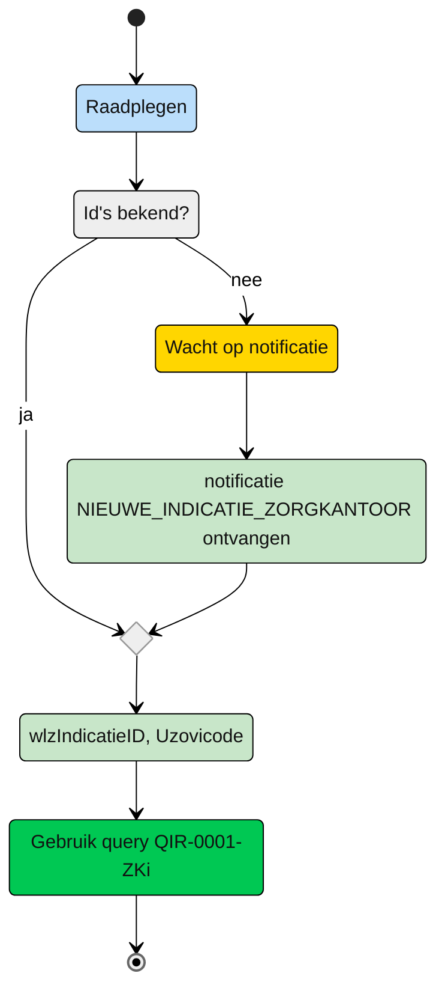

# Query-templates voor het Zorgkantoor

Op dit moment zijn de volgende rollen onderkent:
| Situatie | toelichting |
| :-- |:-- |
 | [Intieel verantwoordelijk Zorgkantoor](#zorgkantoor---initieel-verantwoordelijk) | Een zorgkantoor dat initieel verantwoordelijk is voor de client en zorgt voor de bemiddeling van zorg | 
| [Nieuw verantwoordelijk zorgkantoor](#zorgkantoor---nieuw-verantwoordelijk) | Het zorgkantoor dat de client krijgt overgedragen van het huidige verantwoordelijk zorgkantoor |
| [Uitvoerend zorgkantoor](#zorgkantoor---uitvoerend) | Een zorgkantoor dat bovenregionaal betrokken is bij de uitvoering van zorg | 


## Zorgkantoor - intieel verantwoordelijk

Het zorgkantoor dat verantwoordelijk is voor de regio waarin de client volgens de BRP woont ontvangt de notificiatie Deze notificatie bevat de informatie om de Wlz Indicatie van de client te raadplegen. Naast de ```wlzIndicatieID``` uit de notificatie moeten het eigen ```Uzovicode``` en de datum van oprvagen (```raadpleegdatum```) worden meegegeven.

**Schematisch:**



| **Query ID** | **Beschrijving** | **Verplichte input** | **resultaat** | **Autorisatie** |
|---|---|---|---|---|
| [**QIR-0001-ZKi**](/gql-query/zorgkantoor/QIR-0001-ZKi.graphql) | Op basis van de (ontvangen) wlzIndicatieID en eigen identificatie, de bijbehorende WlzIndicatie raadplegen inclusief Clientgegevens | wlzIndicatieID,  Uzovicode, raadpleegdatum | Alle klassen/nodes | IRA0001 |

## Zorgkantoor - nieuw verantwoodelijk

Query is nog niet beschikbaar doordat het Bemiddelingsregister nog niet volledig in gebruik is. (Overdracht verloopt tot die tijd via ZK31)


## Zorgkantoor - uitvoerend

Query is nog niet beschikbaar doordat het Bemiddelingsregister nog niet volledig in gebruik is. (Uitvoerend zorgkantoor is altijd de bronhouder zelf en anders via ZK33 indicatiegegevens)


