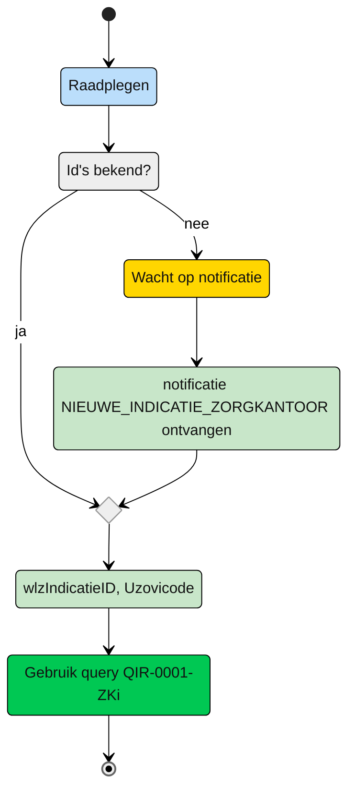
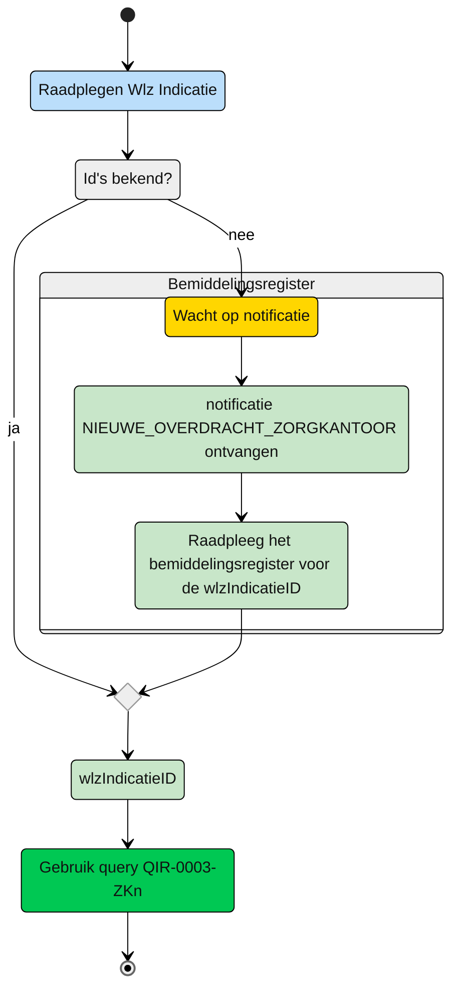
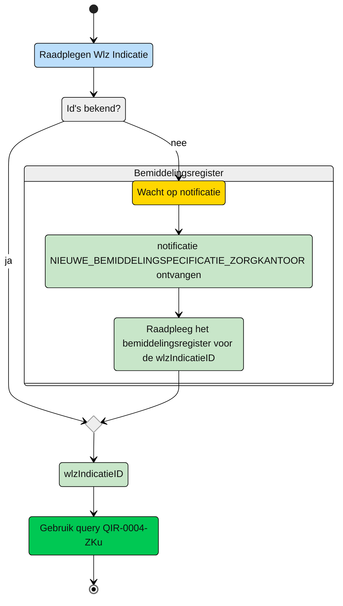

# Query-templates voor het Zorgkantoor

Op dit moment zijn de volgende rollen onderkent:
| Situatie | toelichting |
| :-- |:-- |
 | [initieel verantwoordelijk Zorgkantoor](#zorgkantoor---initieel-verantwoordelijk) | Een zorgkantoor dat initieel verantwoordelijk is voor de client en zorgt voor de bemiddeling van zorg | 
| [Nieuw verantwoordelijk zorgkantoor](#zorgkantoor---nieuw-verantwoordelijk) | Het zorgkantoor dat de client krijgt overgedragen van het huidige verantwoordelijk zorgkantoor |
| [Uitvoerend zorgkantoor](#zorgkantoor---uitvoerend) | Een zorgkantoor dat bovenregionaal betrokken is bij de uitvoering van zorg | 


## Zorgkantoor - initieel verantwoordelijk

Het zorgkantoor dat verantwoordelijk is voor de regio waarin de client volgens de BRP woont ontvangt de notificatie Deze notificatie bevat de informatie om de Wlz Indicatie van de client te raadplegen. Naast de ```wlzIndicatieID``` uit de notificatie moeten het eigen ```Uzovicode``` en de datum van opvragen (```raadpleegdatum```) worden meegegeven.

**Schematisch:**



| **Query ID** | **Beschrijving** | **Verplichte input** | **resultaat** | **Autorisatie-regel** |
|---|---|---|---|---|
| [**QIR-0001-ZKi**](/gql-query/zorgkantoor/QIR-0001-ZKi.graphql) | Op basis van de (ontvangen) wlzIndicatieID en eigen identificatie, de bijbehorende WlzIndicatie raadplegen inclusief cliëntgegevens | wlzIndicatieID,  Uzovicode | Alle klassen/nodes | [IRA0001](https://informatiemodel.istandaarden.nl/informatiemodel/iwlz/netwerk/indicatieregister-2/regels/autorisatieregel/ira0001/) |

### autorisatieflow en query
Autorisatieflow en query: [QIR-0001-ZKi-autorisatieflow](/gql-query/zorgkantoor/QIR-0001-ZKi-autorisatieflow.md)

## Zorgkantoor - nieuw verantwoordelijk

Na een dossieroverdracht via de registratie van een ```Overdracht``` ontvangt het nieuw verantwoordelijke zorgkantoor de notificatie ```NIEUWE_OVERDRACHT_ZORGKANTOOR``` waarmee dat zorgkantoor informatie kan ophalen met betrekking tot de overdracht en zo ook de ```wlzIndicatieID```.

**schematisch:**



| **Query ID** | **Beschrijving** | **Verplichte input** | **resultaat** | **Autorisatie-regel** |
|---|---|---|---|---|
| [**QIR-0003-ZKn**](/gql-query/zorgkantoor/QIR-0003-ZKn.graphql) | Op basis van de (opgehaalde) wlzIndicatieID en eigen identificatie, de bijbehorende WlzIndicatie raadplegen inclusief cliëntgegevens | wlzIndicatieID | Alle klassen/nodes | [IRA0001](https://informatiemodel.istandaarden.nl/informatiemodel/iwlz/netwerk/indicatieregister-2/regels/autorisatieregel/ira0001/) |

### autorisatieflow en query
Autorisatieflow en query: [QIR-0003-ZKn-autorisatieflow](/gql-query/zorgkantoor/QIR-0003-ZKn-autorisatieflow.md)

## Zorgkantoor - uitvoerend

Een bovenregionaal zorgkantoor ontvangt van het verantwoordelijke zorgkantoor de notificatie   ```NIEUWE_BEMIDDELINGSPECIFICATiE_ZORGKANTOOR``` waarmee dat zorgkantoor informatie kan ophalen met betrekking tot de overdracht en zo ook de ```wlzIndicatieID```.

**schematisch:**



| **Query ID** | **Beschrijving** | **Verplichte input** | **resultaat** | **Autorisatie-regel** |
|---|---|---|---|---|
| [**QIR-0004-ZKu**](/gql-query/zorgkantoor/QIR-0003-ZKn.graphql) | Op basis van de (opgehaalde) wlzIndicatieID en eigen identificatie, de bijbehorende WlzIndicatie raadplegen inclusief cliëntgegevens | wlzIndicatieID | Alle klassen/nodes | [IRA0002](https://informatiemodel.istandaarden.nl/informatiemodel/iwlz/netwerk/indicatieregister-2/regels/autorisatieregel/ira0002/) |

### autorisatieflow en query
Autorisatieflow en query: [QIR-0004-ZKu-autorisatieflow](/gql-query/zorgkantoor/QIR-0004-ZKu-autorisatieflow.md)

---
[Terug naar Query overzicht](/gql-query/README.md)

