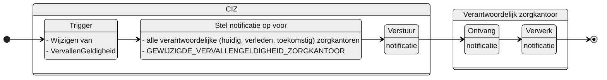

# GEWIJZIGDE_VERVALLENGELDIGHEID_ZORGKANTOOR

## Documentatie

Notificatie aan het zorgkantoor als het CIZ een VervallenGeldigheid heeft gewijzigd van een Wlz-indicatie waarvoor dit zorgkantoor verantwoordelijk is, was of wordt.

Het zorgkantoor is daarmee op de hoogte gesteld dat een Wlz-indicatie is vervallen. De notificatie bevat informatie waarmee dat zorgkantoor de Wlz-indicatie kan raadplegen.

## Aanleiding
**De trigger voor de notificatie is:** 

  > het wijzigen van VervallenGeldigheid bij een Wlz-indicatie. 

## Instructie
**Stel notificatie op voor:** 

> - het zorgkantoor dat verantwoordelijk is voor de Wlz-indicatie
> - het zorgkantoor dat verantwoordelijk is geweest voor de Wlz-indicatie
> - het zorgkantoor dat door overdracht verantwoordelijk wordt voor de Wlz-indicatie

## Type
Het type-notificatie: 
> VERPLICHT

## Schematisch




## Inhoud van de notificatie

| Variabele | Waarde | Voorbeeld | 
| :-- | :-- | :-- |
| timestamp | {timestamp} | ```"timestamp": "2024-07-02T00:00:00.000Z"``` | 
| afzenderIDType | "KVK" | ```"afzenderIDType": "KVK"``` |
| afzenderID | "62253778" | ```"afzenderID": "62253778"``` |
| ontvangerIDType | "UZOVI" | ```"ontvangerIDType": "UZOVI"``` |
| ontvangerID | {uzovi-code ontvanger} | ```"ontvangerID": "5151"``` |
| ontvangerKenmerk | NULL | |
| eventType | "GEWIJZIGDE_VERVALLENGELDIGHEID_ZORGKANTOOR" | ```"eventType": "GEWIJZIGDE_VERVALLENGELDIGHEID_ZORGKANTOOR"``` |
| subjectList |  | ```"subjectList": [{```|
| ../subject | "WlzIndicatie/{wlzIndicatieID}" | ```"subject": "WlzIndicatie/ef88ce35-58fa-4e6d-ac7a-6e298dd211d6"``` |
| ../recordID | "WlzIndicatie/{wlzIndicatieID}" | ```"recordID": "WlzIndicatie/ef88ce35-58fa-4e6d-ac7a-6e298dd211d6"``` |
| | | ```}]``` | 


## Andere notificaties Indicatieregister
[Andere notificaties Indicatieregister](README.md)

## Meer informatie over Notificaties
Meer informatie over notificeren in het [Afsprakenstelsel iWlz](https://wlz.atlassian.net/wiki/x/5AlgAQ?atlOrigin=eyJpIjoiNzMyN2E3MjM3YjQwNGQ4MmFkZDgwNWY0ZmE0MDIzMGEiLCJwIjoiYyJ9): [link](https://wlz.atlassian.net/wiki/x/5AlgAQ?atlOrigin=eyJpIjoiNzMyN2E3MjM3YjQwNGQ4MmFkZDgwNWY0ZmE0MDIzMGEiLCJwIjoiYyJ9)
