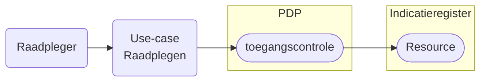

# Raadplegen Indicatieregister

Het raadplegen van het Indicatieregister is gebonden aan voorwaarden. De raadpleger moet bevoegd zijn én het vastgestelde raadpleegpatroon volgen. Dit patroon is essentieel voor het valideren van de toestemming. 

Als het patroon niet wordt gevolgd — bijvoorbeeld door ontbrekende autorisatie, onjuiste of incomplete input, of het opvragen van ongeoorloofde gegevens — wordt de toegang geweigerd of het resultaat beperkt.

Use-cases beschrijven hoe een deelnemer het register correct raadpleegt.

Meer informatie over de structuur van het raadplegen en het valideren ervan is te lezen in het [Afsprakenstelsel iWlz - Raadplegen](https://wlz.atlassian.net/wiki/x/KgpgAQ)

## Use-cases raadplegen Indicatieregister

De use-cases voor het raadplegen van het Indicatieregister per rol en bijbehorende beschrijving van de toegangscontrole door de PDP[^1]. 

Kies een use-case voor de beschrijving van het raadplegen of controleren van de toegang van die raadpleging.

### Zorgaanbieder
| Rol | toelichting | raadplegen | toegangscontrole |
| :-- |:-- | :-- | :-- |
| **Uitvoerend** | Een zorgaanbieder die betrokken is bij de uitvoering van zorg | [UCIR-0002-raadplegen](/raadplegen/zorgaanbieder/UCIR-0002-raadplegen.md) | [UCIR-0002-toegangscontrole](/raadplegen/zorgaanbieder/UCIR-0002-toegangscontrole.md) |

### Zorgkantoor

| Rol | toelichting | raadplegen | toegangscontrole |
| :-- |:-- | :-- | :-- |
| **Initieel** verantwoordelijke | Een zorgkantoor dat initieel verantwoordelijk is voor de client en zorgt voor de bemiddeling van zorg | [UCIR-0001-raadplegen](/raadplegen/zorgkantoor/UCIR-0001-raadplegen.md) | [UCIR-0001-toegangscontrole](/raadplegen/zorgkantoor/UCIR-0001-toegangscontrole.md) | 
| **Nieuw** verantwoordelijk | Het zorgkantoor dat de client krijgt overgedragen van het huidige verantwoordelijk zorgkantoor | [UCIR-0003-raadplegen](/raadplegen/zorgkantoor/UCIR-0003-raadplegen.md) | [UCIR-0003-toegangscontrole](/raadplegen/zorgkantoor/UCIR-0003-toegangscontrole.md) |
| **Uitvoerend** | Een zorgkantoor dat bovenregionaal betrokken is bij de uitvoering van zorg | [UCIR-0004-raadplegen](/raadplegen/zorgkantoor/UCIR-0004-toegangscontrole.md) | [UCIR-0004-toegangscontrole](/raadplegen/zorgkantoor/UCIR-0004-toegangscontrole.md) | 

[^1]: PDP: Policy Decision Point. [Afsprakenstelsel iWlz - Raadplegen](https://wlz.atlassian.net/wiki/x/KgpgAQ)

---
Terug naar [HOME](/README.md)