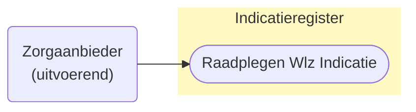
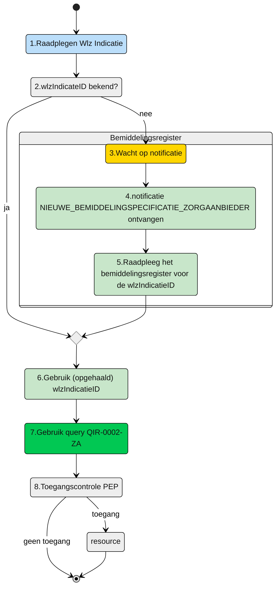

# Raadplegen van Wlz-indicatie door (uitvoerende) Zorgaanbieder (UCIR-0002) 




## **Use Case Beschrijving**  
**Titel:** Raadplegen van Wlz-indicatie door een Zorgaanbieder  
**Actoren:** Zorgaanbieder betrokken bij de uitvoering van zorg aan een client  

### Precondities:
- De Wlz-indicatie is opgenomen in het Indicatieregister.
- De zorgaanbieder is door het verantwoordelijk zorgkantoor betrokken bij de levering van zorg aan de client door de registratie van een bemiddelingspecificatie

### Autorisatie:
Een zorgaanbieder met een toewijzing voor het leveren van zorg aan een cliënt mag de bijbehorende Wlz-indicatie van de cliënt raadplegen.
- Volledige autorisatieregel: [IRA0003-informatiemodel](https://informatiemodel.istandaarden.nl/informatiemodel/iwlz/netwerk/indicatieregister-2/regels/autorisatieregel/ira0003/)
- Autorisatiematrix: [IRA0003](https://github.com/iStandaarden/iWlz-Autorisatiematrix/blob/main/autorisatiematrix_indicatieregister.md)

**Trigger:**
- De zorgaanbieder wil de Wlz-indicatie raadplegen ter ondersteuning van het leveren van zorg aan een cliënt.


## Query-template beschrijving

| **Query ID** | **Beschrijving** | **Verplichte input** | **resultaat** | 
|---|---|---|---|
| [QIR-0002-ZA](/gql-query/zorgaanbieder/QIR-0002-ZA.graphql) |  Op basis van de (opgehaalde) wlzIndicatieID en eigen identificatie, de bijbehorende WlzIndicatie raadplegen inclusief cliëntgegevens | `wlzIndicatieID` | Alle klassen/nodes |


## **Proces raadplegen**
Een zorgaanbieder wordt bij de zorg van een client betrokken door het zorgkantoor. Het zorgkantoor registreert een bemiddelingspecificatie voor de zorgaanbieder. De zorgaanbieder ontvangt hiervan een notificatie ```NIEUWE_BEMIDDELINGSPECIFICATIE_ZORGAANBIEDER```. Op basis van deze notificatie kan de zorgaanbieder de ```wlzIndicatieID``` raadplegen in het Bemiddelingsregister (zie hiervoor de queries voor het raadplegen van het [Bemiddelingsregister](https://github.com/iStandaarden/iWlz-bemiddeling)). Met deze ```wlzIndicatieID``` kan de zorgaanbieder de Wlz-indicatie gegevens raadplegen. 


**schematisch:**




| # | Toelichting |
| --: | :-- |
| 1. | *Start* | 
| 2. | Is de **```wlzIndicatieID```** bekend? <br/> - **Ja** →  Ga verder naar stap 6 <br/> - **Nee** → Wacht op notificatie [NIEUWE_BEMIDDELINGSPECIFICATIE_ZORGAANBIEDER](https://github.com/iStandaarden/iWlz-bemiddeling/blob/Bemiddelingsregister-1/notificaties/nieuwe_bemiddelingspecificatie_zorgaanbieder.md)  | 
| 4. | Notificatie is ontvangen | 
| 5. | Gebruik de informatie uit de notificatie voor het raadplegen van het Bemiddeingsregister en wlzIndicatieID |
| 6. | De **Zorgaanbieder** vult de verplichte **```wlzIndicatieID```** in query-template [QIR-0002-ZA.graphql](/gql-query/zorgaanbieder/QIR-0002-ZA.graphql) en initieert een raadpleging van de Wlz-indicatie in het Indicatieregister. | 
| 7. | De **Zorgaanbieder** stuurt Graphql-request + Access-token naar het Policy Enforcement Point (PEP) |
| 8. | De PEP voert de [toegangscontrole](UCIR-0002-toegangscontrole.md) uit en stuurt bij toegang het request door naar het Indicatieregister. |
| 9. | De zorgaanbieder ontvangt response van de PEP (bij ongeldig verzoek) of vanuit het Indicatieregister (resource) |
| 10. | *Einde proces* | 


---

Ga naar [toegangscontrole](UCIR-0002-toegangscontrole.md) -- Terug naar [Raadplegen](/raadplegen/README.md)
