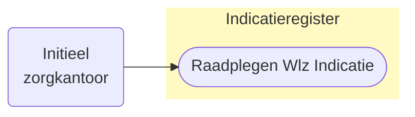
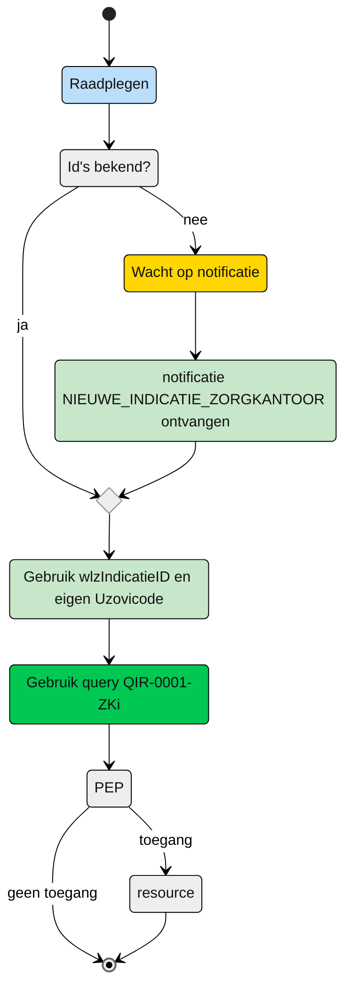

# Raadplegen van Wlz-indicatie door initieel verantwoordelijk Zorgkantoor (UCIR-0001) 




## **Use Case Beschrijving**  
**Titel:** Raadplegen van Wlz-indicatie door initieel verantwoordelijk Zorgkantoor  
**Actoren:** Initieel verantwoordelijk Zorgkantoor  

### Precondities:
- De Wlz-indicatie is opgenomen in het Indicatieregister.
- Het zorgkantoor was op de afgiftedatum van de Wlz-indicatie verantwoordelijk.


### Autorisatie:
Een zorgkantoor mag voor het toeleiden van een cliënt de Wlz-indicatie raadplegen waarvoor dat zorgkantoor op de afgiftedatum verantwoordelijk is.
- Volledige autorisatieregel: [IRA0001A](IRA0001A.md) / [IRA0001-informatiemodel](https://informatiemodel.istandaarden.nl/informatiemodel/iwlz/netwerk/indicatieregister-2/regels/autorisatieregel/ira0001/)
- Autorisatiematrix: [IRA0001](https://github.com/iStandaarden/iWlz-Autorisatiematrix/blob/main/autorisatiematrix_indicatieregister.md)

**Trigger:**
- Het zorgkantoor wil de Wlz-indicatie raadplegen ter ondersteuning van het toeleidingsproces van een cliënt.

## Query-template beschrijving

| **Query** | **Beschrijving** | **Verplichte input** | **resultaat** | 
|---|---|---|---|
| [**QIR-0001-ZKi**](/gql-query/zorgkantoor/QIR-0001-ZKi.graphql) | Op basis van de (ontvangen) wlzIndicatieID en eigen identificatie, de bijbehorende WlzIndicatie raadplegen inclusief cliëntgegevens | wlzIndicatieID,  Uzovicode | Alle klassen/nodes | 

## **Proces raadplegen**
Het zorgkantoor dat verantwoordelijk is voor de regio waarin de client volgens de BRP woont ontvangt de notificatie ```NIEUWE_INDICATIE_ZORGKANTOOR```. Nadat het zorgkantoor de notificatie heeft ontvangen mag dat zorgkantoor op ieder willekeurig moment een raadpleging uitvoeren. De notificatie bevat het ```wlzIndicatieID```  om de Wlz Indicatie van de client te raadplegen. 


**Schematisch:**




| # | Toelichting |
| --: | :-- |
| 1. | *Start* | 
| 2. | Is de **```wlzIndicatieID```** bekend? <br/> - **Ja** →  Ga verder naar stap 3 <br/> - **Nee** → Wacht op notificatie [NIEUWE_INDICATIE_ZORGKANTOOR](/notificaties/nieuwe_indicatie_zorgkantoor.md) | 
| 3. | Het **Zorgkantoor** vult de verplichte **```wlzIndicatieID```** en de eigen **```uzovicode```** in query-template [QIR-0001-ZKi.graphql](/gql-query/zorgkantoor/QIR-0001-ZKi.graphql) en initieert een raadpleging van de Wlz-indicatie in het Indicatieregister. | 
| 4. | Het **Zorgkantoor** stuurt Graphql-request + Access-token naar het Policy Enforcement Point (PEP) |
| 5. | De PEP voert de [toegangscontrole](UCIR-0001-toegangscontrole.md) uit en stuurt bij toegang het request door naar het Indicatieregister. |
| 6. | Het zorgkantoor ontvangt response van de PEP (bij ongeldig verzoek) of vanuit het Indicatieregister |
| 7. | *Einde proces* | 


---
Ga naar [toegangscontrole](UCIR-0001-toegangscontrole.md) -- Terug naar [Raadplegen](/raadplegen/README.md)