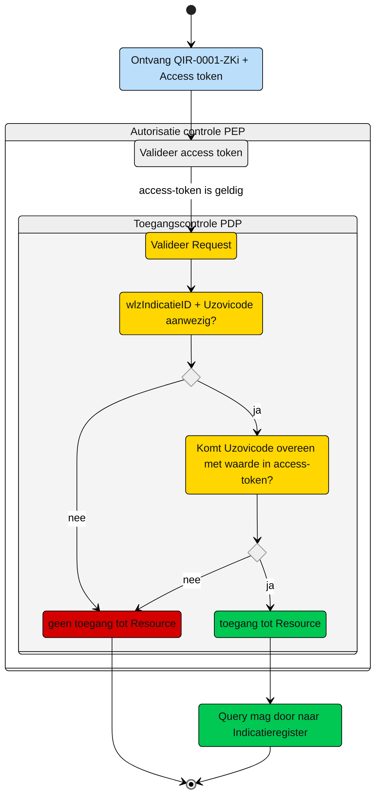

# Toegangscontrole: Raadplegen Indicatieregister door initieel verantwoordelijk Zorgkantoor (UCIR-00001)

Beschrijving van de **toegangscontrole** door de Policy Decision Point (PDP) en indien van toepassing Policy Information Point (PIP).

N.b. Het valideren van de Acces-token door de PEP is geen onderdeel van de ze beschrijving. Zie daarvoor het [Afsprakenstelsel iWlz - nID netwerkstelsel - 5. Policy Enforcement Point.](https://wlz.atlassian.net/wiki/spaces/IWLZAS/pages/229441537/nID+netwerkstelsel#5.-Policy-Enforcement-Point-(PEP))

## Toegangscontrole PDP
### Subject
- **Entiteit:** Zorgkantoor (initieel verantwoordelijk)
- **Kenmerk:** In bezit van een access-token met daarin een de eigen `uzovicode`


### **Action**
- **Type:** `raadplegen` (read)
- **Omschrijving:** Uitvoeren van GraphQL-query `QIR-0001-ZKi.graphql` op het Indicatieregister door een zorgkantoor


### **Resource**
- **Type:** `WlzIndicatie register`
- **ID:** `wlzIndicatieID`
- **Beperking:** Alleen toegang tot gegevens van de Wlz-indicatie waarvoor het zorgkantoor verantwoordelijk is (op basis van `uzovicode` en `wlzIndicatieID`)
- **Inhoud:** Alle nodes in het GraphQL-schema die horen bij deze indicatie mogen worden opgevraagd


### **Context**
- **Query-parameters vereist:** Zowel `wlzIndicatieID` als `uzovicode` moeten zijn meegegeven in de query
- **Uzovicode validatie:** `uzovicode` in de query moet overeenkomen met de `uzovicode` in de access-token
- **Voorwaarde:** Als zowel de parameter `wlzIndicatieID` **als** de parameter `uzovicode` aanwezig zijn in de query, **én** de `uzovicode` in de query **komt overeen** met de `uzovicode` uit de access-token, dan is er **WEL toegang**


### Resultaat

> Toegang tot het Indicatieregister via query `QIR-0001-ZKi.graphql` is **alleen toegestaan** als:
>
> - Beide parameters `wlzIndicatieID` én `uzovicode` zijn meegegeven in de query
> - De `uzovicode` in de query komt overeen met de `uzovicode` in de access-token
> - Dan mogen **alle GraphQL-nodes** die bij deze indicatie horen worden opgevraagd (overeenkomstig query-template)


### Schematisch:



| # | Toelichting |
| --: | :-- |
| 1. |Ontvangst GraphQL-request + access-token door **PEP** |
| 2. |De **PEP** valideert de access-token en geeft na goedkeur het request door aan de PDP |
| 3. |De **PDP** controleert op:<br/>1. Of het request voldoet aan de template en er geen ongeoorloofde gegevens worden opgevraagd.<br/>2. Aanwezigheid van de verplichte parameters in het request;<br/>3. Of de **```uzovicode```** in request overeenkomt met de waarde in de **```access-token```**;<br/><br/>Is aan alle voorwaarden voldaan?<br/> - **Ja** →  Ga verder naar stap 4<br/>- **Nee** → *Einde proces (geen toegang.)*   |
| 4. | Het zorgkantoor krijgt toegang tot alle entiteiten die bij de Wlz-indicatie horen.|
| 5. | *Einde* |


## Toegangscontrole PIP:
```gql
niet van toepassing

```


---
Ga naar [UC beschrijving raadplegen](UCIR-0001-raadplegen.md) -- Terug naar [Raadplegen](/raadplegen/README.md)