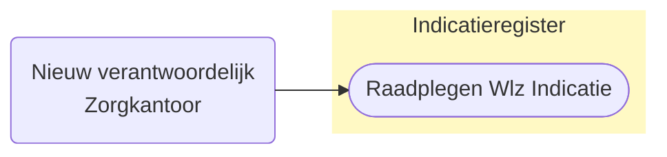
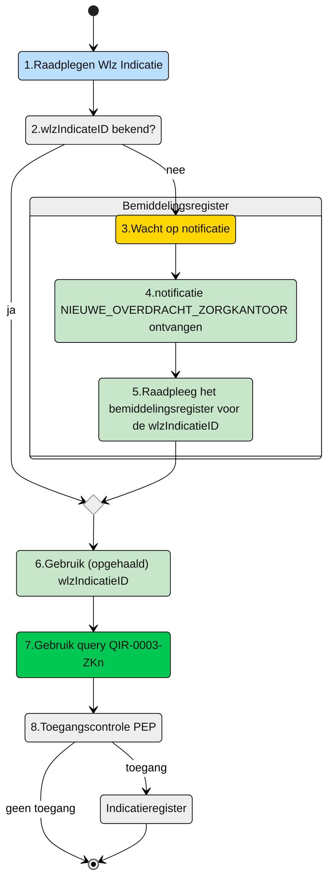

# Raadplegen van Wlz-indicatie door nieuw verantwoordelijk Zorgkantoor (UCIR-0003) 




## **Use Case Beschrijving**  
**Titel:** Raadplegen van Wlz-indicatie door een Zorgkantoor  
**Actoren:** Zorgkantoor dat verantwoordelijk wordt door dossieroverdracht van een client  

### Precondities:
- De Wlz-indicatie is opgenomen in het Indicatieregister.
- Het nieuw verantwoordelijk zorgkantoor is door dossieroverdracht verantwoordelijk gemaakt voor een client door het huidig verantwoordelijk zorgkantoor.


### Autorisatie:
Een zorgkantoor mag voor het toeleiden van een cliënt de Wlz-indicatie raadplegen waarvoor dat zorgkantoor door dossieroverdracht verantwoordelijk geworden is
- Volledige autorisatieregel: [IRA0004-informatiemodel](https://informatiemodel.istandaarden.nl/informatiemodel/iwlz/netwerk/indicatieregister-2/regels/autorisatieregel/ira0004/)
- Autorisatiematrix: [IRA0004](https://github.com/iStandaarden/iWlz-indicatie/blob/Indicatieregister-3/raadplegen/autorisatiematrix_indicatieregister.md)

**Trigger:**
- Het zorgkantoor wil de Wlz-indicatie raadplegen ter ondersteuning van het toeleidingsproces van een cliënt.


## Query-template beschrijving

| **Query ID** | **Beschrijving** | **Verplichte input** | **resultaat** | 
|---|---|---|---|
| [QIR-0003-ZKn](/gql-query/zorgkantoor/QIR-0003-ZKn.graphql) |  Op basis van de (opgehaalde) wlzIndicatieID en eigen identificatie, de bijbehorende WlzIndicatie raadplegen inclusief cliëntgegevens | `wlzIndicatieID` | Alle klassen/nodes |


## **Proces raadplegen**
Een zorgkantoor wordt door dossieroverdracht verantwoordelijk voor de client en mag dan de Wlz indicatie van die client raadplegen in het Indicatieregister. Hiervoor heeft dat zorgkantoor de `wlzIndicatieID` nodig. Hiervoor moet het nieuw verantwoordelijke zorgkantoor eerst het Bemiddelingsregistratie raadplegen. 

Het nieuw verantwoordelijke zorgkantoor ontvangt van het huidig verantwoordelijke zorgkantoor de notificatie `NIEUWE_OVERDRACHT_ZORGKANTOOR`. Op basis van deze notificatie kan het zorgkantoor de ```wlzIndicatieID``` raadplegen in het Bemiddelingsregister (zie hiervoor de queries voor het raadplegen van het [Bemiddelingsregister](https://github.com/iStandaarden/iWlz-bemiddeling)). Met deze ```wlzIndicatieID``` kan het zorgkantoor vervolgens de Wlz-indicatie gegevens raadplegen. 


**schematisch:**




| # | Toelichting |
| --: | :-- |
| 1. | *Start* | 
| 2. | Is de **```wlzIndicatieID```** bekend? <br/> - **Ja** →  Ga verder naar stap 6 <br/> - **Nee** → Wacht op notificatie **`NIEUWE_OVERDRACHT_ZORGKANTOOR`** | 
| 4. | Notificatie is ontvangen | 
| 5. | Gebruik de informatie uit de notificatie voor het raadplegen van het Bemiddeingsregister en wlzIndicatieID |
| 6. | Het **Zorgkantoor** vult de verplichte **```wlzIndicatieID```** in query-template [QIR-0003-ZKn.graphql](/gql-query/zorgkantoor/QIR-0003-ZKn.graphql) en initieert een raadpleging van de Wlz-indicatie in het Indicatieregister. | 
| 7. | Het **Zorgkantoor** stuurt Graphql-request + Access-token naar het Policy Enforcement Point (PEP) |
| 8. | De PEP voert de [toegangscontrole](UCIR-0003-toegangscontrole.md) uit en stuurt bij toegang het request door naar het Indicatieregister. |
| 9. | Het Zorgkantoor ontvangt response van de PEP (bij ongeldig verzoek) of vanuit het Indicatieregister (data) |
| 10. | *Einde proces* | 


---

Ga naar [toegangscontrole](UCIR-0003-toegangscontrole.md) -- Terug naar [Raadplegen](/raadplegen/README.md)
