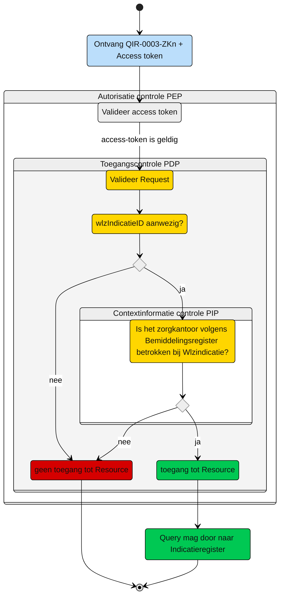

# Toegangscontrole: Raadplegen van Wlz-indicatie door een nieuw verantwoordelijk Zorgkantoor (UCIR-0003) 

Beschrijving van de **toegangscontrole** door de Policy Decision Point (PDP) en indien van toepassing Policy Information Point (PIP).

N.b. Het valideren van de Acces-token door de PEP is geen onderdeel van de ze beschrijving. Zie daarvoor het [Afsprakenstelsel iWlz - nID netwerkstelsel - 5. Policy Enforcement Point.](https://wlz.atlassian.net/wiki/spaces/IWLZAS/pages/229441537/nID+netwerkstelsel#5.-Policy-Enforcement-Point-(PEP))

## Toegangscontrole PDP
### Subject
- **Entiteit:** Nieuw verantwoordelijk Zorgkantoor
- **Kenmerk:** In bezit van een access-token met daarin de eigen `uzovicode`


### **Action**
- **Type:** `raadplegen` (read)
- **Omschrijving:** Uitvoeren van GraphQL-query [`QIR-0003-ZKn.graphql`](/gql-query/zorgkantoor/QIR-0003-ZKn.graphql) op het Indicatieregister door een zorgkantoor.


### **Resource**
- **Type:** `WlzIndicatie register`
- **ID:** `wlzIndicatieID`
- **Beperking:** Alleen toegang tot gegevens van de Wlz-indicatie waarvoor het zorgkantoor een overdracht aanwezig is in het Bemiddelingsregister. `verantwoordelijkZorgkantoor` in de `Overdracht` moet overeenkomen met `uzovicode` uit de access-token;  
- **Inhoud:** Alle nodes in het GraphQL-schema die horen bij deze indicatie mogen worden opgevraagd.


### **Context**
- **Query-parameters vereist:** De `wlzIndicatieID` moet zijn meegegeven in de query
- **Toegangsvoorwaarde:**  Er is alleen toegang als aan **alle** volgende voorwaarden is voldaan:
  - De parameter `wlzIndicatieID` is aanwezig in de query;
  - De **access-token** bevat een geldige `uzovicode` van het zorgkantoor;
  - In het **Bemiddelingsregister** bestaat er een `Overdracht` waarbij:
    1.  De `verantwoordelijkZorgkantoor` overeenkomt met de `uzovicode` uit de access-token, **én**
    2.  Deze `Overdracht` behoort tot een `Bemiddeling` waarvoor de `wlzIndicatieID` overeenkomt met de opgevraagde waarde.


### Resultaat

> Toegang tot het Indicatieregister via query [`QIR-0003-ZKn.graphql`](/gql-query/zorgkantoor/QIR-0003-ZKn.graphql) is **alleen toegestaan** als:
>
> - Parameter **`wlzIndicatieID`** is meegegeven in de query
> - De access-token bevat een geldige **`uzovicode`**
> - In het Bemiddelingsregister is een match gevonden tussen:
>   - De **`uzovicode`** (uit de access-token)
>   - En een **`Overdracht`** die hoort bij een **`Bemiddeling`** met opgevraagde **`wlzIndicatieID`**
> 
> Indien aan deze voorwaarden is voldaan, mogen alle bijbehorende GraphQL-nodes worden opgevraagd conform de structuur van de query-template


# Toegangscontrole-flows Zorgkantoor: QIR-0003-ZKn.graphql

Beschrijving van het toegangscontrole-proces door de PEP.

**schematisch:**



| # | Toelichting |
| --: | :-- |
| 1. |Ontvangst GraphQL-request + access-token door **PEP** |
| 2. |De **PEP** valideert de access-token en geeft na goedkeur het request door aan de PDP |
| 3. |De **PDP** controleert op:<ol><li>Of het request voldoet aan de template en er geen ongeoorloofde gegevens worden opgevraagd.<li> Aanwezigheid van de verplichte parameters in het request;</ol>Is aan alle voorwaarden voldaan?<br/> - **Ja** →  Controle context-informatie door **PIP**: stap 4<br/>- **Nee** → geen toegang tot de resource - *Einde proces (geen toegang.)* |  
| 4. | De **PIP** controleert in het `Bemiddelingsregister` op de aanwezigheid van een `Overdracht` waarbij:<br/><ol><li>De `verantwoordelijkZorgkantoor` overeenkomt met de `uzovicode` uit de access-token, **én** <li>Deze `Overdracht` behoort tot een `Bemiddeling` waarvoor de `wlzIndicatieID` overeenkomt met de opgevraagde waarde en `verantwoordelijkZorgkantoor` in die `Bemiddeling` ongelijk is aan de `uzovicode` in de access-token.</ol> Is aan de voorwaarde voldaan?<br/> - **Ja** →  Toegang tot de resource: stap 5<br/>- **Nee** → geen toegang tot de resource - *Einde proces (geen toegang.)*  |
| 5. | Het zorgkantoor krijgt toegang tot alle entiteiten die bij de Wlz-indicatie horen.
| 6. | *Einde*


## Toegangscontrole PIP:
```gql
query Bemiddeling(
  $WlzIndicatieID: UUID! # afkomstig uit query
  $uzovicodeNieuwzorgkantoor: String! # afkomstig uit Acces-token
) {
  overdracht(
    where: {
      verantwoordelijkZorgkantoor: { eq: $uzovicodeNieuwzorgkantoor }
      and: [ {
         bemiddeling:  {
            and:  {
               wlzIndicatieID:  {
                  eq: $WlzIndicatieID
               }
               verantwoordelijkZorgkantoor:  {
                  neq: $uzovicodeNieuwzorgkantoor
               }
            }
         }
      }]
    }
  ) {
      verantwoordelijkZorgkantoor
      bemiddeling {
        wlzIndicatieID
      }
    }
  }

```

---
Ga naar [UC beschrijving raadplegen](UCIR-0003-raadplegen.md) -- Terug naar [Raadplegen](/raadplegen/README.md)