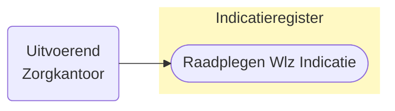
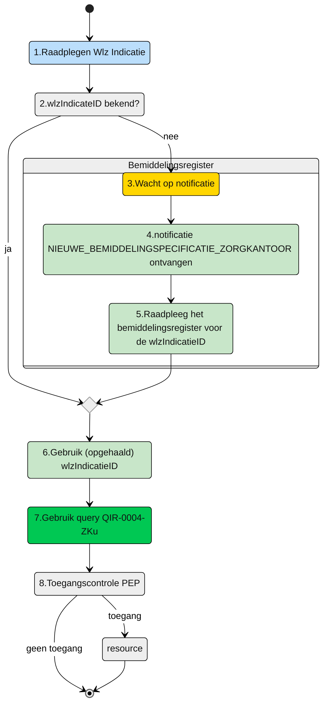

# Raadplegen van Wlz-indicatie door uitvoerend (bovenregionaal) Zorgkantoor (UCIR-0004) 




## **Use Case Beschrijving**  
**Titel:** Raadplegen van Wlz-indicatie door een Zorgkantoor  
**Actoren:** Zorgkantoor betrokken bij de uitvoering van zorg aan een client. (Bovenregionaal zorgkantoor)  

### Precondities:
- De Wlz-indicatie is opgenomen in het Indicatieregister.
- Het Zorgkantoor is door het verantwoordelijk zorgkantoor betrokken bij de levering van zorg aan de client door de registratie van een bemiddelingspecificatie

### Autorisatie:
Een zorgkantoor mag voor het toeleiden van een client de Wlz-indicatie raadplegen die hoort bij de toewijzingen waarvoor dat zorgkantoor uitvoerend zorgkantoor is
- Volledige autorisatieregel: [IRA0002-informatiemodel](https://informatiemodel.istandaarden.nl/informatiemodel/iwlz/netwerk/indicatieregister-2/regels/autorisatieregel/ira0002/)
- Autorisatiematrix: [IRA0002](https://github.com/iStandaarden/iWlz-Autorisatiematrix/blob/main/autorisatiematrix_indicatieregister.md)

**Trigger:**
- Een zorgkantoor wil de Wlz-indicatie raadplegen ter ondersteuning van het leveren van zorg aan een cliënt.


## Query-template beschrijving

| **Query ID** | **Beschrijving** | **Verplichte input** | **resultaat** | 
|---|---|---|---|
| [QIR-0004-ZKu](/gql-query/zorgkantoor/QIR-0004-ZKu.graphql) |  Op basis van de (opgehaalde) wlzIndicatieID en eigen identificatie, de bijbehorende WlzIndicatie raadplegen inclusief cliëntgegevens | `wlzIndicatieID` | Alle klassen/nodes |


## **Proces raadplegen**
Een bovenregionaal zorgkantoor wordt bij de zorg van een client betrokken door het verantwoordelijk zorgkantoor. Het verantwoordelijk zorgkantoor registreert een bemiddelingspecificatie voor een zorgaanbieder die onder verantwoordelijkheid van het bovenregional zorgkantoor valt. 

Het zorgkantoor ontvangt hiervan een notificatie ```NIEUWE_BEMIDDELINGSPECIFICATIE_ZORGKANTOOR```. Op basis van deze notificatie kan het zorgkantoor de ```wlzIndicatieID``` raadplegen in het Bemiddelingsregister (zie hiervoor de queries voor het raadplegen van het [Bemiddelingsregister](https://github.com/iStandaarden/iWlz-bemiddeling)). Met deze ```wlzIndicatieID``` kan het zorgkantoor de Wlz-indicatie gegevens raadplegen. 


**schematisch:**




| # | Toelichting |
| --: | :-- |
| 1. | *Start* | 
| 2. | Is de **```wlzIndicatieID```** bekend? <br/> - **Ja** →  Ga verder naar stap 6 <br/> - **Nee** → Wacht op notificatie **`NIEUWE_BEMIDDELINGSPECIFICATIE_ZORGKANTOOR`**  | 
| 4. | Notificatie is ontvangen | 
| 5. | Gebruik de informatie uit de notificatie voor het raadplegen van het Bemiddeingsregister en wlzIndicatieID |
| 6. | Het **Zorgkantoor** vult de verplichte **```wlzIndicatieID```** in query-template [QIR-0004-ZKn.graphql](/gql-query/zorgkantoor/QIR-0004-ZKu.graphql) en initieert een raadpleging van de Wlz-indicatie in het Indicatieregister. | 
| 7. | Het **Zorgkantoor** stuurt Graphql-request + Access-token naar het Policy Enforcement Point (PEP) |
| 8. | De PEP voert de [toegangscontrole](UCIR-0004-toegangscontrole.md) uit en stuurt bij toegang het request door naar het Indicatieregister. |
| 9. | Het zorgkantoor ontvangt response van de PEP (bij ongeldig verzoek) of vanuit het Indicatieregister (resource) |
| 10. | *Einde proces* | 


---

Ga naar [toegangscontrole](UCIR-0004-toegangscontrole.md) -- Terug naar [Raadplegen](/raadplegen/README.md)
