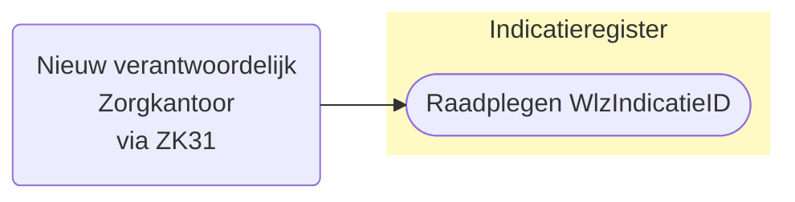
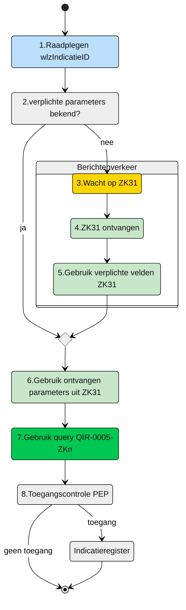

# Raadplegen van WlzIndicatieID door nieuw verantwoordelijk Zorgkantoor via ZK31 (UCIR-0005) 




## **Use Case Beschrijving**  
**Titel:** Raadplegen van Wlz-indicatie door een Zorgkantoor  
**Actoren:** Zorgkantoor dat verantwoordelijk wordt door dossieroverdracht van een client  

### Precondities:
- De Wlz-indicatie is opgenomen in het Indicatieregister.
- Het nieuw verantwoordelijk zorgkantoor is door ontvangst van een ZK31 verantwoordelijk gemaakt voor een client door het huidig verantwoordelijk zorgkantoor.


### Autorisatie:
Een zorgkantoor mag voor het toeleiden van een cliënt de Wlz-indicatie raadplegen waarvoor dat zorgkantoor door dossieroverdracht verantwoordelijk geworden is
- Volledige autorisatieregel: [IRA0001-informatiemodel](https://informatiemodel.istandaarden.nl/informatiemodel/iwlz/netwerk/indicatieregister-2/regels/autorisatieregel/ira0001/)
- Autorisatiematrix: [IRA0001](https://github.com/iStandaarden/iWlz-Autorisatiematrix/blob/main/autorisatiematrix_indicatieregister.md)

**Trigger:**
- Het zorgkantoor wil de Wlz-indicatie raadplegen ter ondersteuning van het toeleidingsproces van een cliënt.


## Query-template beschrijving

| **Query ID** | **Beschrijving** | **Verplichte input** | **resultaat** | 
|---|---|---|---|
| [QIR-0005-ZKn](/gql-query/zorgkantoor/QIR-0005-ZKn.graphql) |  Op basis van de (ontvangen) bsn, besluitnummer, afgiftedatum en ingangsdatum en eigen identificatie, de bijbehorende WlzIndicatieID | `bsn`, `besluitnummer`, `afgiftedatum`, `ingangsdatum` | `WlzIndicatieID` |


## **Proces raadplegen**
Een zorgkantoor wordt door dossieroverdracht via een ZK31 verantwoordelijk voor de client en mag dan de Wlz indicatie van die client raadplegen in het Indicatieregister. Hiervoor en voor de verdere afhandeling van de dossieroverdracht heeft dat zorgkantoor de `wlzIndicatieID` nodig. (WlzIndicatieID is een verplichte waarde voor het kunnen registreren van een Bemiddeling). 

Dit gegeven zit niet in de ZK31. Daarvoor is het nodig dat het zorgkantoor op basis van informatie uit de ZK31 het gegeven kan opvragen.


**schematisch:**




| # | Toelichting |
| --: | :-- |
| 1. | *Start* | 
| 2. | Zijn de verplichte parameters bekend? <br/> - **Ja** →  Ga verder naar stap 6 <br/> - **Nee** → Wacht op  **`ZK31`** | 
| 4. | Bericht is ontvangen | 
| 5. | Gebruik de informatie uit de ZK31 voor het raadplegen van het Indicatieregister voor de wlzIndicatieID |
| 6. | Het **Zorgkantoor** vult de verplichte **```parameters```** in query-template [QIR-0005-ZKn.graphql](/gql-query/zorgkantoor/QIR-0005-ZKn.graphql) en initieert een raadpleging van de Wlz-indicatie in het Indicatieregister. | 
| 7. | Het **Zorgkantoor** stuurt Graphql-request + Access-token naar het Policy Enforcement Point (PEP) |
| 8. | De PEP voert de [toegangscontrole](UCIR-0005-toegangscontrole.md) uit en stuurt bij toegang het request door naar het Indicatieregister. |
| 9. | Het Zorgkantoor ontvangt response van de PEP (bij ongeldig verzoek) of vanuit het Indicatieregister (data) |
| 10. | *Einde proces* | 


---

Ga naar [toegangscontrole](UCIR-0005-toegangscontrole.md) -- Terug naar [Raadplegen](/raadplegen/README.md)
