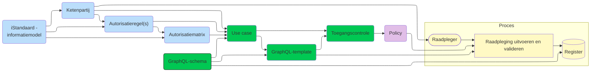

```mermaid
---
config:
  look: classic
  layout: elk
---
flowchart LR
 subgraph s3["Proces"]
        n10(["Raadpleger"])
        n11["Raadpleging uitvoeren en valideren"]
        n12["Register"]
  end
    n1["iStandaard - <br>informatiemodel"] --> n2["Autorisatieregel(s)"] & n3["Autorisatiematrix"] & n4["Ketenpartij"]
    n4 --> n2 & n5["Use case"] & n10
    n2 --> n3 & n5
    n3 --> n5
    n6["GraphQL-schema"] --> n5 & n7["GraphQL-template"] & n12
    n5 --> n7 & n8["Toegangscontrole"]
    n7 --> n8 & n11
    n8 --> n9["Policy"]
    n10 --> n11
    n9 --> n11
    n11 --> n12
    n12@{ shape: db}
    n1@{ shape: rounded}
    n2@{ shape: rounded}
    n3@{ shape: rounded}
    n4@{ shape: rounded}
    n5@{ shape: rounded}
    n6@{ shape: rounded}
    n7@{ shape: rounded}
    n8@{ shape: rounded}
    n9@{ shape: rounded}
    style n10 fill:#FFF9C4
    style n11 fill:#FFF9C4
    style n12 fill:#FFF9C4
    style n1 fill:#BBDEFB
    style n2 fill:#BBDEFB
    style n3 fill:#BBDEFB
    style n4 fill:#BBDEFB
    style n5 fill:#00C853
    style n6 stroke:#000000,fill:#00C853
    style n7 fill:#00C853
    style n8 fill:#00C853
    style n9 fill:#E1BEE7

```